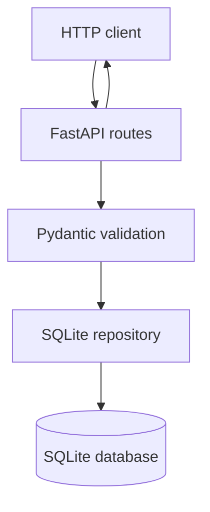

# Architecture

## Context and quality goals

VulnTrack is deliberately small enough to understand in one sitting but real
enough to demonstrate validation, persistence, HTTP integration, automated
quality gates, and releases. The priorities are reproducibility, traceability,
safe input handling, and testability rather than horizontal scale.

## Components

| Component | Responsibility | Depends on |
|---|---|---|
| FastAPI application factory | lifecycle, metadata, route registration | repository |
| HTTP routes | status codes and request/response contract | Pydantic schemas, repository |
| Pydantic schemas | validation and serialization | domain enums |
| domain enums | severity and triage vocabulary | Python standard library |
| SQLite repository | schema and parameterized CRUD | SQLite, schemas |
| Make targets | platform-neutral automation | Python tools |
| CI definitions | orchestration and artifacts | Make targets |

## Finding contract

A finding has:

- UUID `id`;
- `title`, `description`, `affected_asset`, and `source`;
- `severity`: `low`, `medium`, `high`, or `critical`;
- `status`: `new`, `confirmed`, `in_progress`, or `resolved`;
- finite `cvss_score` from 0.0 through 10.0;
- UTC `created_at` and `updated_at` timestamps.

Create input omits server-owned identity, status, and timestamps. Update input
requires at least one non-null mutable field. Response models forbid unexpected
fields and preserve enum and timestamp types.

## Request lifecycle

1. FastAPI parses path and query values.
2. Pydantic rejects missing, blank, unknown, or out-of-range fields with 422.
3. The route calls the repository; it never constructs SQL.
4. The repository uses static SQL identifiers and bound values.
5. Missing UUIDs become 404; successful creation and deletion become 201 and
   204 respectively.
6. Response-model validation serializes a stable JSON contract.

## Persistence decision

SQLite was selected because it is transactional, available in Python without a
separate service, and reproducible on hosted CI runners. A connection is scoped
to one repository operation and closed deterministically. Tests use temporary
database paths.

SQLite is not presented as the default for multi-region availability or high
write concurrency. Isolating SQL behind `SQLiteFindingRepository` allows a
future PostgreSQL adapter without changing HTTP schemas.

## Security boundaries

- External values are validated before persistence.
- SQL values are parameters; update column names are static.
- Database, environment, reports, and build output are ignored by Git.
- CI has read-only repository permission except the isolated release job.
- SAST, dependency audit, candidate-secret detection, and tests are independent
  gates.

Static tools are fallible. Their passing result means only that the configured
checks found no blocking result at that time.

## Testability

`create_app(database_path)` injects an isolated database for integration tests.
Repository tests do not require HTTP. Schema tests do not require persistence.
This separation keeps failures local while the integration suite proves the
assembled application.

## Deployment notes

The package produces a universal Python wheel and source distribution. A
deployment must provide persistent storage for `VULNTRACK_DATABASE`, run one
schema-compatible service version at a time, and place TLS/authentication at an
appropriate gateway. Authentication and distributed migrations are outside
the assignment scope and are recorded as production gaps, not silently assumed.
