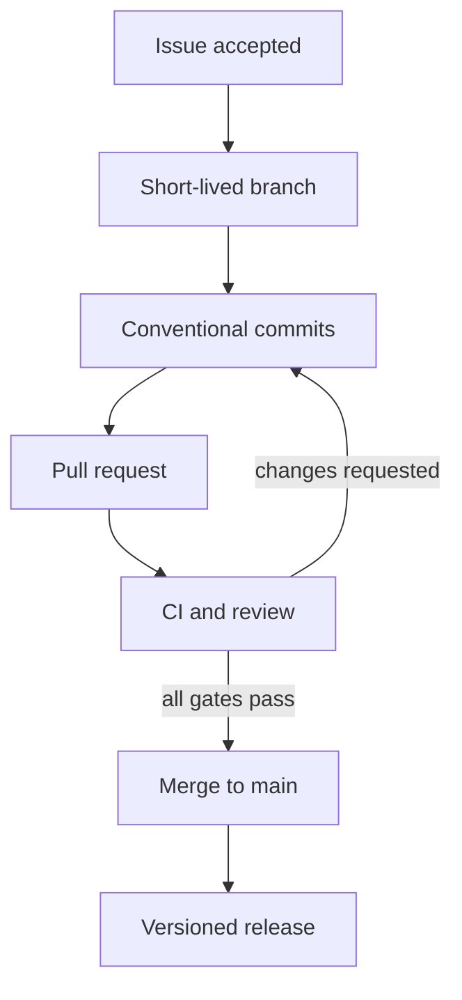

# Git workflow

## Selected model: GitHub Flow

GitHub Flow fits a small service with one stable line, short changes, and
frequent CI feedback. Git Flow would add long-lived develop and release branches
without multiple maintained release trains; trunk-based development would
reduce issue-to-branch visibility needed by this assignment.

## Stable branch

`main` is the only stable branch. It should always pass the required CI stages
and be releasable. No development occurs directly on `main`.

## Branch naming

```text
<kind>/<issue-number>-<short-kebab-description>
```

Kinds include `feat`, `fix`, `test`, `ci`, `security`, `docs`, `chore`, and
`release`. Examples: `feat/26-filtering-statistics` and
`security/22-local-controls`.

## Lifecycle



1. Create or select an issue before implementation.
2. Branch from current `main` and reference the issue number in the name.
3. Commit logically complete changes using Conventional Commits.
4. Open a PR early enough for review; include `Closes #N` only for issues the PR
   actually completes.
5. Require formatting, lint, tests/coverage, build, and security stages.
6. Address review with new commits so the before/after evidence remains.
7. Resolve discussions only after the correcting CI run succeeds.
8. Merge with a merge commit for this experiment, preserving PR and conflict
   topology; delete short-lived branches after verification.

## Merge policy

Allowed for the assignment: merge commits. Squash would hide the required
meaningful commit series and two-parent conflict evidence. Rebase is useful
before review in many teams, but rewriting a reviewed branch is avoided here.

Direct pushes, branch deletion, and force push to `main` should be disabled by
repository rules. The evidence matrix distinguishes controls actually enforced
in GitHub settings from controls that are only documented because the connected
API cannot configure them.

## Release rule

Semantic Versioning tags point to verified `main` commits. The release job
reuses the build artifact from the same gated pipeline. A normal PR cannot run
the release job; only a `v*` tag or the explicitly documented release commit on
`main` is a release context.

## Conflict handling

Never choose “ours” or “theirs” blindly. Identify the intent of both branches,
edit the final file, remove markers, run all affected tests, and commit a
two-parent merge. The exact cases are recorded in
[`conflict-resolution.md`](conflict-resolution.md).

## Risks and mitigations

| Risk | Mitigation |
|---|---|
| unstable main | required sequential CI and PR-only process |
| large PRs | short-lived issue-scoped branches |
| missing review capacity | transparent self-review, never fake approval; seek a real collaborator when independent approval is mandatory |
| bypassed hooks | repeat all mandatory checks in CI |
| stale branch conflict | merge current main, resolve explicitly, preserve two-parent evidence |
| accidental release | release job restricted to tag/release context after all gates |
